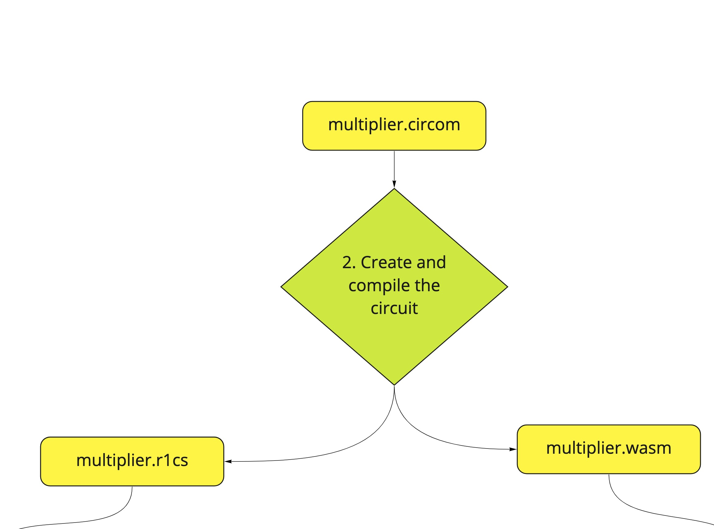
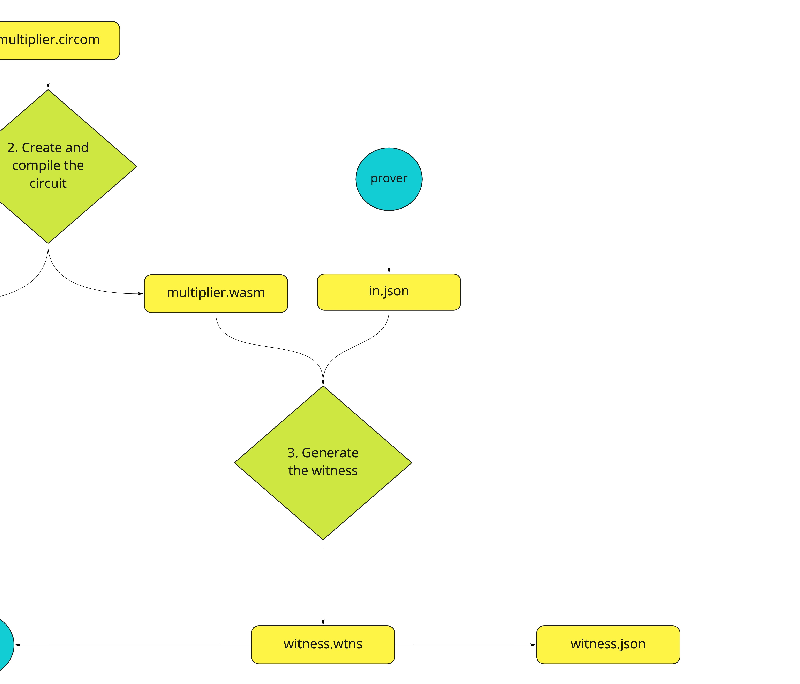
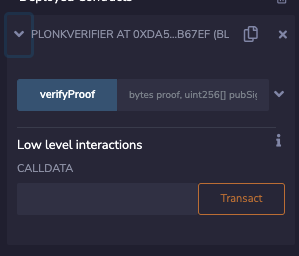
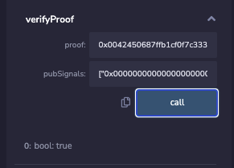
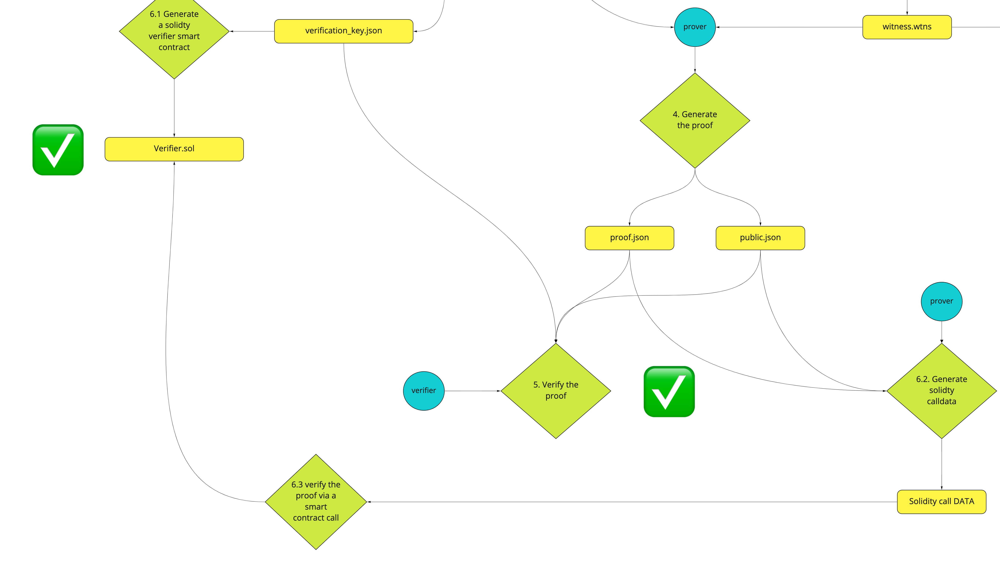

This tutorial is inspired by the presentation "All About the ZkVerse | Polygon" performed by Jordi Baylina at EthDenver22. Unfortunately, the recording of the webinar is no longer available.

# **Introduction to Zero Knowledge Proof**

To understand zero knowledge proof, it is first necessary to define the 2 actors involved in the process and their roles:

1. A Prover, who executes a computation and wants to prove to any third party that the computation was valid 
2. A Verifier, whose role is to verify that the computation done by someone else was valid

A computation is any deterministic program that gets input(s) and returns output(s). The naive way for a verifier to verify that a computation done by a third party was valid would be to run the same program with the same input(s) and check if the output is the same.

But what if the program took one day to compute for the prover? Then the verifier (and anybody who wants to verify its correctness) has to spend one day to verify if the computation was performed correctly. This process is highly inefficient. 

How does Zero Knowledge Proof work?

- It all starts with having a deterministic program (*circuit*)
- The prover executes the computation and computes the output of the program
- The prover, starting from the circuit and the output, computes a **proof** of his/her computation and give it to the verifier
- The verifier can now run a more lightweight computation starting from the proof and verify that the prover did the entire computation correctly. **The verifier doesn’t need to know the whole set of inputs to verify the correctness of the computation**

Starting from this definition, we can define the two main application areas of ZKP:
- scalability, which benefits from the lower effort needed for the verifier to verify the correctness of the computation
- privacy, which benefits from the fact that the verifier can verify the correctness of the output provided without having to know the entire set of inputs needed to get there


In cryptography, a zero-knowledge proof is a method by which one party (the prover) can prove to another party (the verifier) that he/she knows a value x that fulfills some constraints, without revealing any information apart from the fact that he/she knows the value x.

## **ZKP as scalability-enabling technology**

For example, right now, miners need to validate every single transaction and add it to a new block and other nodes, to approve it and reach consensus will need to check the validity of the transactions by processing each one of them.

With ZKP they don't need to, a prover can validate every single transaction, bundle them all together and generate a proof of this computation. Any other party (verifiers) can get the **public** inputs of the computation, the **public** output, and the proof generated by the prover and verify the validity of the computation in just a few milliseconds. They don't need to compute all the transactions once again. Just need to compute the proof.

That's how ZKP can enable scalability in blockchain technology. 

It's important to note that:
- While the effort of the verifier needed to verify the computation is orders of magnitude lower than what would be needed without ZKP, the effort in terms of computation needed to (generate proof + process all the transactions) > (process all the transactions)
- Here's there's no really a zero-knowledge component, all the inputs of the computation are public. The main benefit that ZKP brings here is the succinctness of the proof

We can define: 

Zero-knowledge proof is a method by which one party (the prover) can prove to another party (the verifier) in an easily verifiable way that he/she was able to execute a computation within some constraints starting from a public set of inputs.

**This is the magic of scalability enabled by zkp**

## **ZKP as privacy-enabling technology**

The prover can execute a hash function (non-reversible function) and provide the result of the function + the proof. From these two pieces, the verifier can verify that the prover ran the function correctly without knowing the inputs of the function. 

Note that in this case, the function inputs are **private** so the prover doesn't have to reveal any detail about the data used to generate the hash function. Here's where the zero-knowledge/privacy component comes into place. 

The scalability and privacy applications are enabled by the **succinct nature of the proof**, namely the proof doesn't contain anything about the origin of the information and is really small.

We can define: 

Zero-knowledge proof is a method by which one party (the prover) can prove to another party (the verifier) that the prover knows a value x that fulfills some constraints without revealing any information apart from the fact that he/she knows the value x.

**This is the magic of privacy enabled by zkp**

## **Examples of circuits**


- The last line of the circuit sets the constraints of the system and explains how to compute the output

The circom templates are also composable: in the next example, we compose the XOR template within the Composite circuit.

**In circom circuits the inputs by default are private, and the output by defualt is public. But you can change that by saying which input are public if you want to put some public inputs. We say that inputs s2 and s4 are public even though they could all be considered private and it will still work!**


[Github/iden3/circomlib](https://github.com/iden3/circomlib) is a tooling set of standard circiuts!

[Github/iden3/snarkJs](https://github.com/iden3/snarkjs) is a javascript library. It is useful to generate proof in the browser!

# **CircomDemo**

The demo that I am gonna run is based on the privacy application side of ZKP. The demo will be based of 5 steps:
1. Circom and dependencies setup
2. Create and compile the circuit 
3. Generate the witness 
4. Generate the proof 
5. Verify the proof
6. Verify the proof via a smart contract

Each step of the demo, the data, the actors, and their actions are better explained in this board


Here's the link to the Miro board: https://miro.com/app/board/uXjVODmIOnk=/?invite_link_id=155047731605

## 1. Circom and dependencies setup

### install rust

`curl --proto '=https' --tlsv1.2 [https://sh.rustup.rs](https://sh.rustup.rs/) -sSf | sh`

### build circom from source

`git clone [https://github.com/iden3/circom.git](https://github.com/iden3/circom.git)`

`cd circom`

`cargo build --release`

`cargo install --path circom`

### install snarkjs

`npm install -g snarkjs`

### create a working directory

`mkdir zkverse`

`cd zkverse`

## 2. Create and compile the circuit
        
### create a basic circuit (add a multiplier.circom file to the factor directory)

```jsx
template Multiplier () { 
    
    signal input a; 
    signal input b; 
    signal output c; 
    
    c <== a*b; 
} 

component main = Multiplier();
```

This circuit describes a basic computation: starting from two inputs (a, b) and multiplying them together to get to c. 

A circuit is a deterministic program containing the constraints that must be respected to successfully run the computation successfully. In simple terms it contains the instructions that must be respected to get from inputs a and b to output c.

The goal for the prover is to prove to a verifier that he/she knows two numbers (a,b) that, when multiplied together, give a specific number (c).

The inputs (a,b) are to be kept private. The verifier doesn't have access to it. 
The output (c) is public. The verifier has access to it.

### Compile the circuit

`circom multiplier.circom --r1cs --wasm --sym --c`

It's important to notice that by running this command it is generating two types of files:

--r1cs it generates the file multiplier.r1cs that contains the constraint system of the circuit in binary format.
--wasm: it generates the directory multiplier_js that contains the Wasm code (multiplier.wasm) and other files needed to generate the witness.

### Print info on the circuit

`snarkjs r1cs info multiplier.r1cs`

```jsx
[INFO]  snarkJS: Curve: bn-128
[INFO]  snarkJS: # of Wires: 4
[INFO]  snarkJS: # of Constraints: 1
[INFO]  snarkJS: # of Private Inputs: 2
[INFO]  snarkJS: # of Public Inputs: 0
[INFO]  snarkJS: # of Labels: 4
[INFO]  snarkJS: # of Outputs: 1
```

By running this command, it is able to extract the information that describes our circuit (multiplier.circom).



## 3. Generate the witness 

### Generate the witness

The witness is the set of inputs, intermediate circuit signals and output generated by prover's computation. 

For the sake of this example, the prover is choosing 3 and 11 as inputs for the computation. The inputs are added in a .json file *in.json*


To generate the witness `node multiplier_js/generate_witness.js multiplier_js/multiplier.wasm in.json witness.wtns`

It is passing in 3 parameters:
- `multiplier_js/multiplier.wasm` is the previously generated file needed to generate the witness 
-`in.json` is the file that describes the input of the computation  
- `witness.wtns` is the output file. Witness.wtns will display all the intermediary values that the program is computing 

### Display the witness 

Right now the file `witness.wtns` is in binary so it needs to be converted to .json to actually read that.

`snarkjs wtns export json witness.wtns witness.json`

Here's how the witness looks like:


The file describes the wires computed by the circuit. In simple terms, the intermediary steps computed by the circuit to get from the inputs to the output.

- 1 is just a constant of the constraints system generated
- 33 is the public output (namely the product of the multiplication between my inputs)
- 3, 11 are the private inputs



## 4. Generate the proof 

### Download the trusted setup (Powers of tau file) 

`wget https://hermez.s3-eu-west-1.amazonaws.com/powersOfTau28_hez_final_11.ptau`

It is a community-generated trusted setup. A trusted setup is an algorithm that determines a protocol’s public parameters using information that must remain secret to ensure the protocol’s security.

### Generate the verification key

The verification key is generated starting from `multiplier.r1cs` (description of the circuit and its constraints) and `powersOfTau28_hez_final_11.ptau` which is the trusted setup. The output file of the operation is `multiplier.zkey`, namely the verification key for the circuit.

`snarkjs plonk setup multiplier.r1cs powersOfTau28_hez_final_11.ptau multiplier.zkey`

### Get a verification key in json format (from the proving key)

`snarkjs zkey export verificationkey multiplier.zkey verification_key.json` 


### Generate the proof

Let's zoom back for a second. The prover holds:
- A witness (`witness.wtns`) that describes its computation starting from the public inputs (3, 11) to the output (33)
- A verifcation key (`multiplier.zkey`)

The goal now is to generate a proof starting from these files and provide it to the verifier. 

`snarkjs plonk prove multiplier.zkey witness.wtns proof.json public.json`

The outputs are:
- The proof of the computation (`proof.json`)
- The public values are included in the computation (`public.json`). In this particular case the only public value visible by the verifier is the output of the computation so the public.json file will be a single-value array (" 33")

Here's the plonk proof:


## 5. Verify the proof

Now the focus switches to the side of the verifier. The verifier only has access to the `public.json`, `proof.json` and `verification_key.json` files. 
It is important to underline that none of these files contains information about the inputs chosen by the prover to run the computation.
His/her goal is to prove that the computation performed by the prover was correct, namely that he input 2 correct numbers in order to get to 33 **without knowing any information about the a,b inputs chosen to run the computation**

### Verify the proof

`snarkjs plonk verify verification_key.json public.json proof.json`

As you can see to do that I only need to have the verification key (`verification_key.json)`, the public output (`public.json`) and the computation proof `proof.json`


The result of the command tells that the result of the verification is positive! 

You can try to modify a single unit in the proof file and will see that the verification will fail.


In this case snarkjs has been run in the command line but you can integrate it in any node program in the browser. 


## 6. Verify the proof via a smart contract

### 6.1. Generate a solidity verifier smart contract

Snarkjs provides a tool that allows generating a solidity smart contract in order to validate this proof. It is generated starting from the multiplier.zkey. The output of the program is the `verifier.sol` file

`snarkjs zkey export solidityverifier multiplier.zkey verifier.sol`

Now you can run this contract on remix (copy and paste it) 

This contract has just one function that is *verifyProof* that takes the proof as input and outputs a bool (true or false) telling if the verification was successful or not.




### 6.2. Generate solidty calldata

In this second scenario, the verifier is the smart contract itself. 
The verification is performed similarly as before, it only needs to export the `proof.json` and `public.json` files in bytes format in order to let verifier.sol understand it.

In order to generate the proof in bytes format, it needs to run 

`snarkjs zkey export soliditycalldata public.json proof.json`

Below is the result of the command:

`0x0042450687ffb1cf0f7c333db2982bd2c2a04924a9c10e05b7d966a5f9a263ae1fa2fc80239eaf1331729c9146bedc06968660902bd81684d41dc95ae5a5716d1ff330b82ff5f10604766de384ca6436e836b3a6fa828afb29b2c57b13df2f380fce01af98935ed6c5b4e9ae4c74dec49c55d67e895256def7e422b3c47b29f500a972d862f78e14db6fd4a4274dffb2b7206ccd2129aae29a053b5a6b3a6ba00bf1d7016eef734cf6810da103d5362af17e20b5405088a16dbd87bbb96aca1e0a5a0aa747d6142c682e14329845e846c636165839cdb3f4807fd968a68e03e92156b4d2d4a499d39046acfc637eeb8e7af27ab5ab4e2e5407e35769dbd0ef4f1ac1b7f5a155ede35ee0bc71fcdf6c730d10a10f58400320c698e80ab7a308881e294aadb70e2c7510d8d2b6a484b59fe15a32983917548150508eaf9e23066123414badfecbb9ba6f2eca51ab513e461ea33180d133650e46f66befc1fb6f681feca4c4855fd1d4cbe6f655990a06eb9d3526298a7b32c622f7ee53518c426f1210df9abf5a24192c1eb9280387ead98cfb4de61eabfa4f96e8b611e23f77b42c3d5a242c93eb72fbaec25d117e525d22578e6eeaee50f0390c4c55d073a965281d2887d5d858da9fbb2e03772b618bae962e8824187918dfec541c4f5d9dd41a0b7a5663f4e4f54010db57a6164d449d3b54d0c438e82078bcbedb05e135c1177a173941dd8d29784fe67a86b0ce45c25bb0b7e282c0ade2dedc402b0a645e22fa65e453056fa0405e00d6d71e0ba609b960416739fb17464208e9bb7cadf7072baf18bb81dd951d378d0835255260ee77002418a8e45e3a5f188e2aa5e9b7181542090ce7bb8bdcfaca01b0d73ed959b6998c495a23ffd8fb47e90d995c4a06bfce85c371fae7a6eec979a6d157797cb9e03d1bf1e5fc95e814d56ee0e6122815fa2ce24804ea9135ef638961e5f55d7c572f56cd3b154d04ee7ed92272f20af7fc626b62dbd96505508eef839d3307ad7a9af580f5b8eea8771cca242f1a2ba6db71669aa03d91a0c2a7eb5065e5a38d066f5f9ea9f3290a78c8abe6f0e420f197f1db7408a207eaaec16ac2bbf9baf0febf5c0d4e900cee7ccd5aaba8a8,["0x0000000000000000000000000000000000000000000000000000000000000021"]`

The first part is the proof written in bytes, while the array, in this case, contains only one value (which is 33 written in hexadecimal)

To test it input the proof and the array into the smart contract of remix.



As you can see, the proof has been verified!

Using a smart contract to verify the proof enables developers to include a set of collateral actions to be executed if the proof is verified. For example, you can unlock an NFT airdrop if the user provides valid proof. [Zeko](https://github.com/enricobottazzi/Zeko) library provides the tooling (Zero Knowledge Proof circuits + smart contracts) needed to run a Zero Knowledge Based NFT Airdrop



## **Docs**

- [circom documentation](https://docs.circom.io/getting-started/installation/#installing-circom) 
- [circom github](https://github.com/iden3/circom)
- [circomlib](https://github.com/iden3/circomlib)
- [circomlibjs](https://github.com/iden3/circomlibjs)
- [snarkJS](https://github.com/iden3/snarkjs)
- [rapidSnark](https://github.com/iden3/rapidsnark)

## **Other Resources**
- [zkEVM with Jordi & David from Hermez](https://zeroknowledge.fm/episode-194-zkevm-with-jordi-david-from-hermez/)
- [SNARKS FOR NON-CRYPTOGRAPHERS - obront.eth Twitter post](https://twitter.com/zachobront/status/1501943116923740164?s=20&t=mNJuwAYe7fIPk5Lu5VNhxg)
- [Jordi Baylina : ZK-EVM](https://www.youtube.com/watch?v=17d5DG6L2nw&t=14s)
- [ZK Jargon Decoder - @nico_mnbl](https://nmohnblatt.github.io/zk-jargon-decoder/foreword.html)

