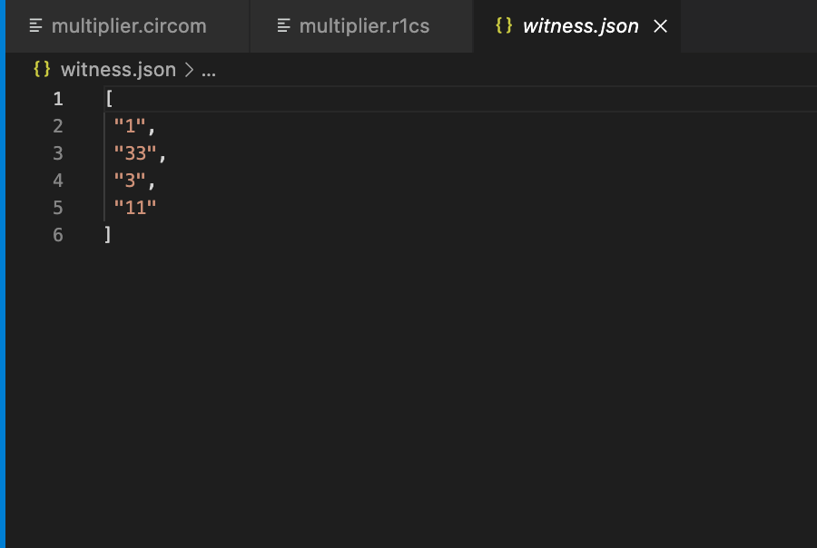
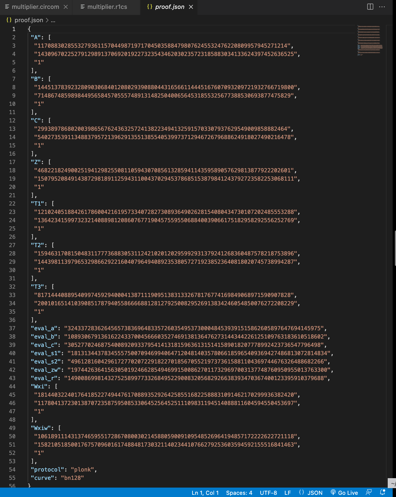
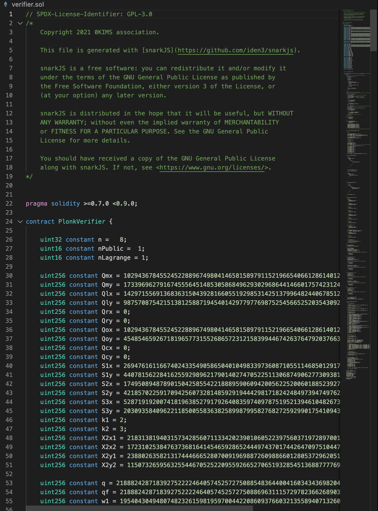

This tutorial is inspired by the presentation "All About the ZkVerse | Polygon" performed by Jordi Baylina at EthDenver22. Unfortunately, the recording of the presentation is no longer available.

# **Introduction to Zero Knowledge Proof?**

To understand zero knowledge proof, it is first necessary to define the 2 actors involved in the process and their roles:

1. A Prover, who executes a computation and wants to proof to any third-party that the computation was valid 
2. A Verifier, whose role is to verifiy that the computation done by someone else was valid

A computation is any deterministic program that gets input(s) and return output(s). The naive way for a verifier to verify that a computation done by a third-party was valid would be to run the exact same program with the same input(s) and check if the output is the same.

But what if the program took 1 day to compute for the prover? Then the verifier (and anybody who wants to verify its correctness) has to spend 1 day to verify if the computation was performed correctly. This process is highly inefficient. 

How does Zero Knowledge Proof works?

- It all starts with have a deterministic program (*circuit*)
- The prover executes the computation and computes the output of the program
- The prover, starting from the circuit and the output, computes a **proof** of his/her computation and give it to the verifier
- The verifier is now able to run a more light weight computation starting from the proof and verify that the prover did the entire computation correctly. **The verifier doesn’t need to know the entire set of inputs to verify the correctness of the computation**

Starting from this definition, we can define the two main application areas of ZKP:
- scalability, which benefit from the lower effort needed for the verifier to verify the correctness of the computation
- privacy, which benefit from the fact that the verifier can verify the correctness of the output provided without having to know the entire set of inputs needed to get there


In cryptography, a zero-knowledge proof is a method by which one party (the prover) can prove to another party (the verifier) that he/she knows a value x that fulfills some constraints, without revealing any information apart from the fact that he/she knows the value x.

## **ZKP as scalability-enabling technology**

For example, right now miners need to validate every single transactions add it to a new block and other nodes, in order to approve it and reach  consensus will need to check the validity of the transactions by processing each one of themòò

With ZKP they don’t need to, a prover can validate every single transaction, bundle them all together and generate a proof of this computation. Any other party (verifiers) can get the **public** inputs of the computation, the **public** output and the proof generated by the prover and verifity the validity of the computation in just a few milliseconds. They don’t need to compute all the transactions once again. Just need to compute the proof.

That's how ZKP can enable scalability in blockchain technology. 

It's important to note that:
- While the effort of the verifier needed to verify the computation is orders of magnitude lower than what would be needed without ZKP, the effort in terms of computation needed to (generate proof + process all the transactions) > (process all the transactions)
- Here's there's no really a zero knowledge compontent, all the inputs of the computation are public. The main benefit that ZKP brings here is the succintness of the proof

We can define: 

Zero-knowledge proof is a method by which one party (the prover) can prove to another party (the verifier) in a easily verifiable way that he/she was able to execute a computations within some contraints starting from a public set of inputs.

**This is the magic of scalability enabled by zkp**

## **ZKP as privacy-enabling technology**

The prover can execute an hash function (non reversable function) and provide the result of the function + the proof. From these two pieces the verifier is able to verify that the prover run the function correctly without knowing the inputs of the function. 

Notet that in this case the inputs of the function are **private** so the prover doesn't have to reveal any detail about the data used to generate the hash function. Here's where the zero knowledge/privacy component comes into place. 

Both the scalability and privacy applications are enabled by the **succint nature of the proof**, namely the proof doesn’t contain anything about the origin of the information and it is really small.

We can define: 

Zero-knowledge proof is a method by which one party (the prover) can prove to another party (the verifier) that prover knows a value x that fulfills some constraints, without revealing any information apart from the fact that he/she knows the value x.

**This is the magic of privacy enabled by zkp**

## **Examples of circuits**


- The last line of the circuit set the contrains of the system and explain how to compute the output

The circom templates are also composable: in the next example we compose the XOR template within the Composite circuit

**In circom circuits the inputs by default are private, and the output by defualt is public. But you can change that by saying which input are public if you want to put some public inputs. In this case we say that inputs s2 and s4 are public even tough they could all be considered private and it will still work!**


[Github/iden3/circomlib](https://github.com/iden3/circomlib) is a tooling set of standard circiuts!

[Github/iden3/snarkJs](https://github.com/iden3/snarkjs) is a javascript library. It is useful to generate proof in the browser!

# **CircomDemo**

The demo that I am gonna run is based on the privacy application side of ZKP. The demo will be based of 5 steps:
1. Circom and dependecies setup
2. Create and compile the circuit 
3. Generate the witness 
4. Generate the proof 

## 1. Circom and dependecies setup

### install rust

`curl --proto '=https' --tlsv1.2 [https://sh.rustup.rs](https://sh.rustup.rs/) -sSf | sh`

### build circom from source

`git clone [https://github.com/iden3/circom.git](https://github.com/iden3/circom.git)`

`cd circom`

`cargo build --release`

`cargo install --path circom`

### install snarkjs

`npm install -g snarkjs`

### create a working directory

`mkdir zkverse`

`cd zkverse`

## 2. Create and compile the circuit
        
### create a basic circuit (add a multiplier.circom file to the factor directory)

```jsx
template Multiplier () { 
    
    signal input a; 
    signal input b; 
    signal output c; 
    
    c <== a*b; 
} 

component main = Multiplier();
```

This circuit describes a basic computation: starting from two inputs (a, b) and multiply them together to get to c. 

A circuit is a deterministic program that contains the constraints that must be respected to run the computation succesfully. In simple terms it contains the instructions that must be respected to get from inputs a and b to output c.

The goal, for the prover, is to prove to a verifier that he/she knows two numbers (a,b) that, when multiplied together, give a specific number (c).

The inputs (a,b) are to be kept private. The verifier don't have access to it. 
The output (c) is public. The verifier has access to it.

### Compile the circuit

`circom multiplier.circom --r1cs --wasm --sym --c`

It's important to notice that by running this command it is generating two types of files:

--r1cs it generates the file multiplier.r1cs that contains the constraint system of the circuit in binary format.
--wasm: it generates the directory multiplier_js that contains the Wasm code (multiplier.wasm) and other files needed to generate the witness.

### Print info on the circuit

`snarkjs r1cs info multiplier.r1cs`

```jsx
[INFO]  snarkJS: Curve: bn-128
[INFO]  snarkJS: # of Wires: 4
[INFO]  snarkJS: # of Constraints: 1
[INFO]  snarkJS: # of Private Inputs: 2
[INFO]  snarkJS: # of Public Inputs: 0
[INFO]  snarkJS: # of Labels: 4
[INFO]  snarkJS: # of Outputs: 1
```

By running this command it is able to extract the information that describes our circuit (multiplier.circom).

## 3. Generate the witness 

### Generate the witness

The witness is the set of inputs, intermediate circuit signals and output generated by prover's computation. 

For the sake of this example, the prover is choosing 3 and 11 as inputs for the computation. The inputs are added in a .json file *in.json*


To generate the witness `node multiplier_js/generate_witness.js multiplier_js/multiplier.wasm in.json witness.wtns`

It is passing in 3 parameters:
- `multiplier_js/multiplier.wasm` is the previously generated file needed to generate the witness 
-`in.json` is the file that describes the input of the computation  
- `witness.wtns` is the output file. Witness.wtns will display all the intermediary values that the program is computing 

### Display the witness 

Right now the file `witness.wtns` is in binary so it needs to be converted to .json to actually read that.

`snarkjs wtns export json witness.wtns witness.json`

Here’s how the witness looks like:



The file describes the wires computed by the circuit. In simple terms, the intermediary steps computed by the circuit to get from the inputs to the output.

- 1 is just a constant of the constraints system generated
- 33 is the public output (namely the product of the multiplication between my inputs)
- 3, 11 are the private inputs

## 4. Generate the proof 

### Download the trusted setup (Powers of tau file) 

`wget https://hermez.s3-eu-west-1.amazonaws.com/powersOfTau28_hez_final_11.ptau`

It is a community generated trusted setup. // what is the trusted setup and why we are downloading it?

### Generate the verification key

// what is the verification key?
// Can it be kept public?

The verification key is generated starting from `multiplier.r1cs` (description of the circuit and its contraints) and `powersOfTau28_hez_final_11.ptau` which is the trusted setup. The output file of the operation is `multiplier.zkey`, namely the verification key for the circuit.

`snarkjs plonk setup multiplier.r1cs powersOfTau28_hez_final_11.ptau multiplier.zkey`

### Get a verification key in json format (from the proving key)

`snarkjs zkey export verificationkey multiplier.zkey verification_key.json` 


### generate the proof

Let's zoom back for a second. The prover holds:
- A witness (`witness.wtns`) that describes its computation starting from the public inputs (3, 11) to the output (33)
- A verifcation key (`multiplier.zkey`) // that describes...

The goal now is to generate a proof starting from these files and provide it to the verifier . 

`snarkjs plonk prove multiplier.zkey witness.wtns proof.json public.json`

The outputs are:
- The proof of the computation (`proof.json`)
- The public values included in the computation (`public.json`). In this particular case the only public value visible by the verifier is the output of the computation so the public.json file will be a single-value array (”33”)

Here’s the plonk proof:



The proof is the file that, when passed to the verifier, will let him
We already have the witness computation. My goal is to proof that I know two numbers that, when multiplied together, the result is 33! 


### Verify the proof

Let’s verify that ⇒ Now I’m on the other side, I’m the verifier. The only stuff that I got (as verifier) in my hand right now are the output and the proof. My goal is to prove that the computation performed by the prover was right, namely that he input 2 correct numbers in order to get to 33. The cool thing about zero knowledge proof is, again, that me (the verifier) never have to know the inputs in order to verify the correctness of the computation.

`snarkjs plonk verify verification_key.json public.json proof.json`

As you can see to do that I only need to have the verification key (`verification_key.json)`, the public output (`public.json`) and the computation proof `proof.json`


This output tells us that the verification has been positive! 

You can try to modify a single unit in the proof file and will see that the verification will fail


In this case snarkjs has been run in the command line but you can integrate it in any node program in the browser. 

### Verify the proof in the smart contract!

Snarkjs provides a tool that generates a solidity code to validate this proof! 

`snarkjs zkey export solidityverifier multiplier.zkey verifier.sol`

- To generate it I need to pass in the multiplier.zkey file (this is very specific to this circuit!)
- The output will be the `verifier.sol` file

Now you can run this contract on remix (copy and paste it) 

The smart contract works that you pass in the proof and you get the verification back (bool true or false)



After compiling and deploying the smart contract on Remix 


This contract has just one function that is *verifyProof*

You need to pass in the proof and the array of the public output that you want to prove (which, in this case, has only one value => 33) 

In order to generate the proof in bytes format you need to run 

`snarkjs zkey export soliditycalldata public.json proof.json`

you get this inside your terminal 

`0x0042450687ffb1cf0f7c333db2982bd2c2a04924a9c10e05b7d966a5f9a263ae1fa2fc80239eaf1331729c9146bedc06968660902bd81684d41dc95ae5a5716d1ff330b82ff5f10604766de384ca6436e836b3a6fa828afb29b2c57b13df2f380fce01af98935ed6c5b4e9ae4c74dec49c55d67e895256def7e422b3c47b29f500a972d862f78e14db6fd4a4274dffb2b7206ccd2129aae29a053b5a6b3a6ba00bf1d7016eef734cf6810da103d5362af17e20b5405088a16dbd87bbb96aca1e0a5a0aa747d6142c682e14329845e846c636165839cdb3f4807fd968a68e03e92156b4d2d4a499d39046acfc637eeb8e7af27ab5ab4e2e5407e35769dbd0ef4f1ac1b7f5a155ede35ee0bc71fcdf6c730d10a10f58400320c698e80ab7a308881e294aadb70e2c7510d8d2b6a484b59fe15a32983917548150508eaf9e23066123414badfecbb9ba6f2eca51ab513e461ea33180d133650e46f66befc1fb6f681feca4c4855fd1d4cbe6f655990a06eb9d3526298a7b32c622f7ee53518c426f1210df9abf5a24192c1eb9280387ead98cfb4de61eabfa4f96e8b611e23f77b42c3d5a242c93eb72fbaec25d117e525d22578e6eeaee50f0390c4c55d073a965281d2887d5d858da9fbb2e03772b618bae962e8824187918dfec541c4f5d9dd41a0b7a5663f4e4f54010db57a6164d449d3b54d0c438e82078bcbedb05e135c1177a173941dd8d29784fe67a86b0ce45c25bb0b7e282c0ade2dedc402b0a645e22fa65e453056fa0405e00d6d71e0ba609b960416739fb17464208e9bb7cadf7072baf18bb81dd951d378d0835255260ee77002418a8e45e3a5f188e2aa5e9b7181542090ce7bb8bdcfaca01b0d73ed959b6998c495a23ffd8fb47e90d995c4a06bfce85c371fae7a6eec979a6d157797cb9e03d1bf1e5fc95e814d56ee0e6122815fa2ce24804ea9135ef638961e5f55d7c572f56cd3b154d04ee7ed92272f20af7fc626b62dbd96505508eef839d3307ad7a9af580f5b8eea8771cca242f1a2ba6db71669aa03d91a0c2a7eb5065e5a38d066f5f9ea9f3290a78c8abe6f0e420f197f1db7408a207eaaec16ac2bbf9baf0febf5c0d4e900cee7ccd5aaba8a8,["0x0000000000000000000000000000000000000000000000000000000000000021"]`

The first part is the proof written in bytes, while the array in this case contains only one value (which is 33 written in hexadecimals)

To test it input the proof and the array into the smart contract of remix 


As you can see the proof has been verified!

## **Docs and other useful resources**

- [circom documentation](https://docs.circom.io/getting-started/installation/#installing-circom) 
- [circom github](https://github.com/iden3/circom)
- [circomlib](https://github.com/iden3/circomlib)
- [circomlibjs](https://github.com/iden3/circomlibjs)
- [snarkJS](https://github.com/iden3/snarkjs)
- [rapidSnark](https://github.com/iden3/rapidsnark)
