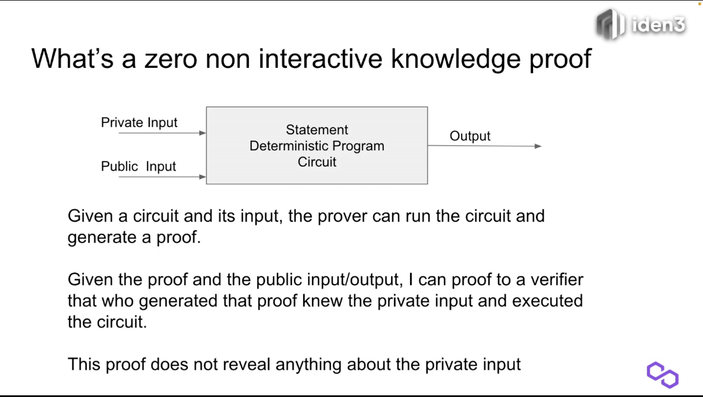
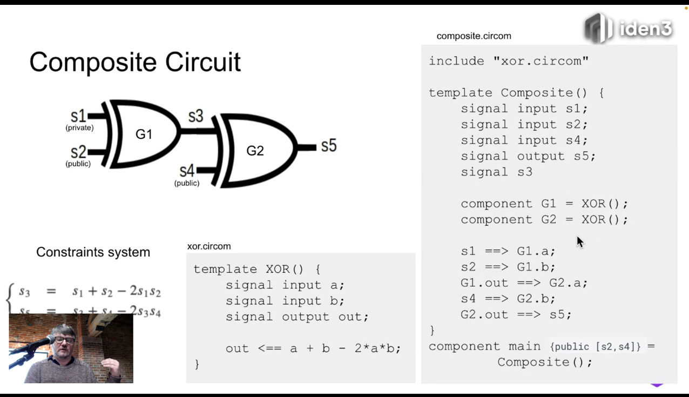
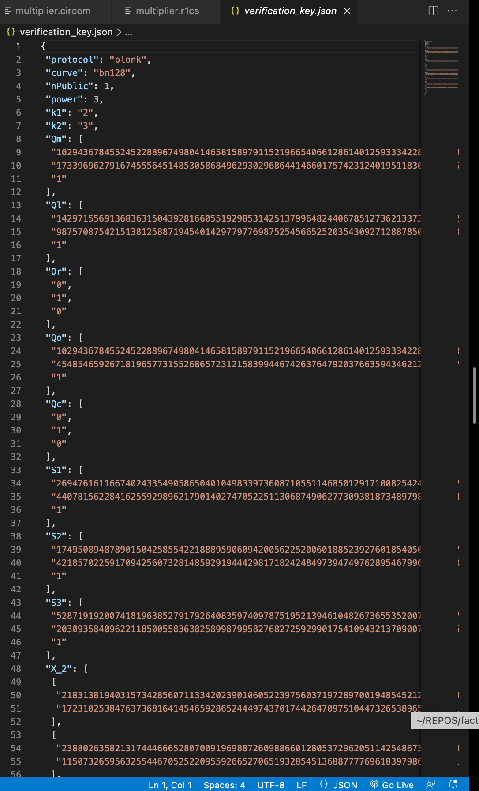

This tutorial is inspired by the presentation "All About the ZkVerse | Polygon" performed by Jordi Baylina at EthDenver22. Here you can find his presentation (h from min 30 to 1h20min ): 
[https://www.twitch.tv/videos/1300382536](https://www.twitch.tv/videos/1300382536) 

## **Going into Circom**

How does verification of computation works today? You have inputs, a detrministic program and an output. The naive way for a verifier to prove that I did the right computation would be to run the same program with the same input and check if the output is the same. 

But what if the program took 1 day to compute? Then the verifier will have to spend 1 day to verify if the computation was performed correctly. 

How does ZKP work? 

- You have a deterministic program (*circuit)*
- I compute the output of my program
- I compute a **proof** of my computation and give it to the verifier
- The verifier will be able to run a more light weight computation starting from the proof I provided and verify that I did the entire computation correctly. **The verifier doesn’t need to know the entire set of inputs to do that**



**This is the magic of scalability enabled by zkp**

## **ZKP into practice**

For example, right now miners need to validate every single transactions add it to a new block and other nodes, in order to approve it and reach  consensus will need to check the validity of the transactions by processing each one of them! 

With ZKP they don’t need to, they can just get the proof and verifity the validity of the computation in just a few milliseconds. They don’t need to compute again all the transactions. Just need to compute the proof! 

**In this case the thing that you are proving is that the computation is valid**

**Why is zero knowledge**? Because you don’t even have to reveal you the inputs! This is really important for privacy perserving applications as well!

I can execute an hash function (non reversable function) and I’ll give you the result of the function + the proof and from these two pieces the verifier is  be able to verify that I run the function correctly without knowing the inputs of the function (this is the zero knowledge part!).

The cool thing of the ZKP is that it allows:

- scalability
- privacy

These two applications are enabled by the **succint nature of the proof**, namely the proof doesn’t contain anything about the origin of the information and it is really small!

Example of a circuit


- The last line of the circuit set the contrains of the system and set how to compute the output

The circom templates are also composable: in the next example we compose the XOR template within the Composite circuit

**In circom circuits the inputs by default are private, and the output by defualt is public. But you can change that by saying which input are public if you want to put some public inputs. In this case we say that inputs s2 and s4 are public even tough they could all be considered private and it will still work!**



Github/iden3/circomlib is a tooling set of standard circiuts!

Github/iden3/snarkJs is a javascript library. Useful to generate proof in the browser!

## **CircomDemo**

### install rust

`curl --proto '=https' --tlsv1.2 [https://sh.rustup.rs](https://sh.rustup.rs/) -sSf | sh`

### build circom from source

`git clone [https://github.com/iden3/circom.git](https://github.com/iden3/circom.git)`

`cd circom`

`cargo build --release`

`cargo install --path circom`

### install snarkjs

`npm install -g snarkjs`

### create a working directory

`mkdir zkverse`

`cd zkverse`
        
### create a basic circuit (add a multiplier.circom file to the factor directory)

```jsx
template Multiplier () { 
    
    signal input a; 
    signal input b; 
    signal output c; 
    
    c <== a*b; 
} 

component main = Multiplier();
```

I want to prove that I know two numbers (private piece) that when you multiply them together it gives a specific number (public piece). 

- c is the output which is public
- a,b are inputs and they are private

### Compile the circuit

`circom multiplier.circom --r1cs --wasm --sym --c`

I am compiling the file *multiplier.circom* and I want to:

- Iutput the constraints in a r1cs format
- Compile the circuit to wasm
- Output witness in sym format
- Compiles the circuit to c

⇒ we now have the multiplier_js folder which is the javascript program to compute the witness  

### Print info on the circuit (from the factor directory)

`snarkjs r1cs info multiplier.r1cs`

```jsx
[INFO]  snarkJS: Curve: bn-128
[INFO]  snarkJS: # of Wires: 4
[INFO]  snarkJS: # of Constraints: 1
[INFO]  snarkJS: # of Private Inputs: 2
[INFO]  snarkJS: # of Public Inputs: 0
[INFO]  snarkJS: # of Labels: 4
[INFO]  snarkJS: # of Outputs: 1
```

We now have set up the circuit, let’s generate a witness

### How to generate the witness: 

`cd multiplier_js` 

`node generate_witness.js`

⇒ Here’s how to generate the witness

`Usage: node generate_witness.js <file.wasm> <input.json> <output.wtns>`

⇒ I need to pass inputs of my function via json file, call it *in.json*


Since the output I’m choosing here are 3 and 11, the output should be 33.

`node multiplier_js/generate_witness.js multiplier_js/multiplier.wasm in.json witness.wtns`

I’m passing 3 parameters:
- the first one `multiplier_js/multiplier.wasm` is the file that I am gonna use to generate the witness 
-`in.json` is the input I just created to generate the witness 
- `witness.wtns` is the file output that I want to generate. In witness.wtns I will see displayed all the intermediary values that the program is computing 

### Viewing the witness 

right now it is in binary so we need to convert it to JSON to actually see that

`snarkjs wtns export json witness.wtns witness.json`

Here’s the witness:


1 is just a constant of the constraints system generated

33 is the public output

3, 11 are the private inputs I’m taking

These 4 values are all the wires computed by the circuit

### Download the trusted setup (Powers of tau file) 

`wget [https://hermez.s3-eu-west-1.awazonaws.com/powersOfTau28_hez_final_11.ptau](https://hermez.s3-eu-west-1.awazonaws.com/powersOfTau28_hez_final_11.ptau)`

It is a community generated trusted setup 

### Plonk setup

`snarkjs plonk setup multiplier.r1cs powersOfTau28_hez_final_11.ptau multiplier.zkey`

Here the multiplier.zkey is the output file of this operation => it is the proving key

### Get a verification key in json format (from the proving key)

`snarkjs zkey export verificationkey multiplier.zkey verification_key.json` 



⇒ The setup is ready! Now we can start generating proofs! 

We already have the witness computation. My goal is to proof that I know two numbers that, when multiplied together, the result is 33! 

### generate the proof

`snarkjs plonk prove multiplier.zkey witness.wtns proof.json public.json`

In order to generate the proof I need: 

- The proving key (`multiplier.zkey`)
- The witness ⇒ the wires executed by the circuit I generated
- The output (proof) will be stored in the proof.json
- The public output of the computation (”33”) will be stored in the public.json file!

Here’s the plonk proof:


### Verify the proof

Let’s verify that ⇒ Now I’m on the other side, I’m the verifier. The only stuff that I got (as verifier) in my hand right now are the output and the proof. My goal is to prove that the computation performed by the prover was right, namely that he input 2 correct numbers in order to get to 33. The cool thing about zero knowledge proof is, again, that me (the verifier) never have to know the inputs in order to verify the correctness of the computation.

`snarkjs plonk verify verification_key.json public.json proof.json`

As you can see to do that I only need to have the verification key (`verification_key.json)`, the public output (`public.json`) and the computation proof `proof.json`


This output tells us that the verification has been positive! 

You can try to modify a single unit in the proof file and will see that the verification will fail


In this case snarkjs has been run in the command line but you can integrate it in any node program in the browser. 

### Verify the proof in the smart contract!


Snarkjs provides a tool that generates a solidity code to validate this proof! 

`snarkjs zkey export solidityverifier multiplier.zkey verifier.sol`

- To generate it I need to pass in the multiplier.zkey file (this is very specific to this circuit!)
- The output will be the `verifier.sol` file

Now you can run this contract on remix (copy and paste it) 

The smart contract works that you pass in the proof and you get the verification back (bool true or false)


After compiling and deploying the smart contract on Remix 


This contract has just one function that is *verifyProof*

You need to pass in the proof and the array of the public output that you want to prove (which, in this case, has only one value => 33) 

In order to generate the proof in bytes format you need to run 

`snarkjs zkey export soliditycalldata public.json proof.json`

you get this inside your terminal 

`0x0042450687ffb1cf0f7c333db2982bd2c2a04924a9c10e05b7d966a5f9a263ae1fa2fc80239eaf1331729c9146bedc06968660902bd81684d41dc95ae5a5716d1ff330b82ff5f10604766de384ca6436e836b3a6fa828afb29b2c57b13df2f380fce01af98935ed6c5b4e9ae4c74dec49c55d67e895256def7e422b3c47b29f500a972d862f78e14db6fd4a4274dffb2b7206ccd2129aae29a053b5a6b3a6ba00bf1d7016eef734cf6810da103d5362af17e20b5405088a16dbd87bbb96aca1e0a5a0aa747d6142c682e14329845e846c636165839cdb3f4807fd968a68e03e92156b4d2d4a499d39046acfc637eeb8e7af27ab5ab4e2e5407e35769dbd0ef4f1ac1b7f5a155ede35ee0bc71fcdf6c730d10a10f58400320c698e80ab7a308881e294aadb70e2c7510d8d2b6a484b59fe15a32983917548150508eaf9e23066123414badfecbb9ba6f2eca51ab513e461ea33180d133650e46f66befc1fb6f681feca4c4855fd1d4cbe6f655990a06eb9d3526298a7b32c622f7ee53518c426f1210df9abf5a24192c1eb9280387ead98cfb4de61eabfa4f96e8b611e23f77b42c3d5a242c93eb72fbaec25d117e525d22578e6eeaee50f0390c4c55d073a965281d2887d5d858da9fbb2e03772b618bae962e8824187918dfec541c4f5d9dd41a0b7a5663f4e4f54010db57a6164d449d3b54d0c438e82078bcbedb05e135c1177a173941dd8d29784fe67a86b0ce45c25bb0b7e282c0ade2dedc402b0a645e22fa65e453056fa0405e00d6d71e0ba609b960416739fb17464208e9bb7cadf7072baf18bb81dd951d378d0835255260ee77002418a8e45e3a5f188e2aa5e9b7181542090ce7bb8bdcfaca01b0d73ed959b6998c495a23ffd8fb47e90d995c4a06bfce85c371fae7a6eec979a6d157797cb9e03d1bf1e5fc95e814d56ee0e6122815fa2ce24804ea9135ef638961e5f55d7c572f56cd3b154d04ee7ed92272f20af7fc626b62dbd96505508eef839d3307ad7a9af580f5b8eea8771cca242f1a2ba6db71669aa03d91a0c2a7eb5065e5a38d066f5f9ea9f3290a78c8abe6f0e420f197f1db7408a207eaaec16ac2bbf9baf0febf5c0d4e900cee7ccd5aaba8a8,["0x0000000000000000000000000000000000000000000000000000000000000021"]`

The first part is the proof written in bytes, while the array in this case contains only one value (which is 33 written in hexadecimals)

To test it input the proof and the array into the smart contract of remix 


As you can see the proof has been verified!

## **Docs and other useful resources**

- [circom documentation](https://docs.circom.io/getting-started/installation/#installing-circom) 
- [circom github](https://github.com/iden3/circom)
- [circomlib](https://github.com/iden3/circomlib)
- [circomlibjs](https://github.com/iden3/circomlibjs)
- [snarkJS](https://github.com/iden3/snarkjs)
- [rapidSnark](https://github.com/iden3/rapidsnark)
